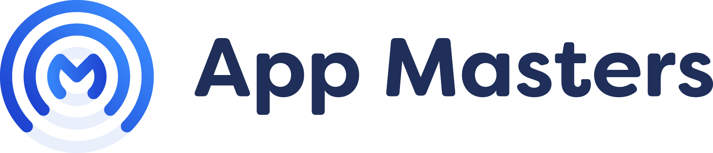
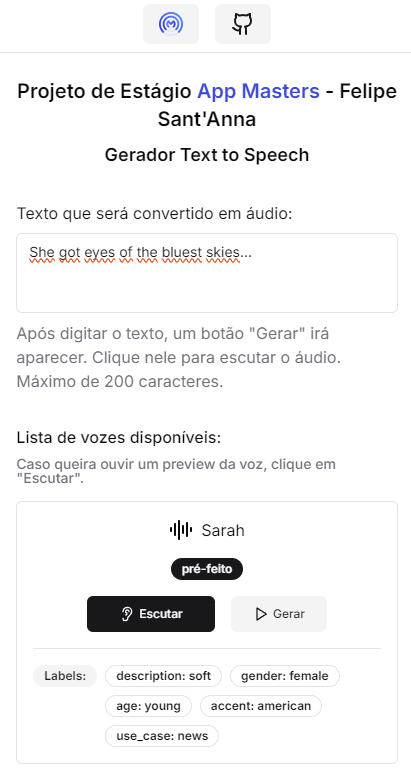
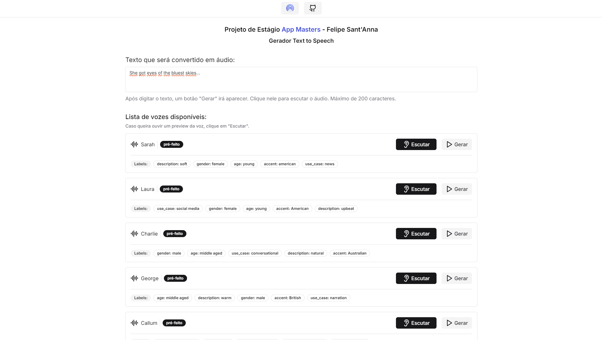

<h1 align="center">
    
</h1>

<h4 align="center"> 
	🤖 Estágio App Masters - Text to Speech ♻️ Concluído 🚀 🚧
</h4>

<p align="center">
 <a href="#-sobre-o-projeto">Sobre</a> •
 <a href="#-funcionalidades">Funcionalidades</a> •
 <a href="#-layout">Layout</a> • 
 <a href="#-como-executar-o-projeto">Como executar</a> • 
</p>


## 💻 Sobre o projeto

🤖 O projeto é uma forma de gerar áudios baseado em um texto customizável, feito com a API da ElevenLabs. O usuário poderá também escolher qual voz utilizar para gerar seu áudio. Desenvolvido por Felipe Sant'Anna.


Projeto desenvolvido para uma vaga de **Estágio** oferecida pela [App Masters](https://www.appmasters.io/pt).
"Somos um grande time de desenvolvimento de software, que busca a excelência no que faz, aprendendo sempre e buscando se aprimorar cada vez mais."

---

## ⚙️ Funcionalidades

- [x] Usuários podem gerar áudios personalizados enviando:
  - [x] um texto de no máximo 200 caracteres

- [x] Usuários podem escutar previamente todas as vozes, para selecionar suas favoritas.

---

## 🎨 Layout

### Mobile

<p align="center">
  
</p>

### Web

<p align="center" style="display: flex; align-items: flex-start; justify-content: center;">
  
</p>

---

## 🚀 Como executar o projeto

Este projeto é divido em duas partes:
1. Backend (pasta /src/app/api) 
2. Frontend

💡Por ser um projeto Next.js, apenas executando o servidor ambas partes irão funcionar.

### Pré-requisitos

Antes de começar, você vai precisar ter instalado em sua máquina as seguintes ferramentas:
[Git](https://git-scm.com), [Node.js](https://nodejs.org/en/). 
Além disto é bom ter um editor para trabalhar com o código como [VSCode](https://code.visualstudio.com/)

#### 🎲 Rodando o servidor

```bash

# Clone este repositório
$ git clone https://github.com/Santannafe12/desafio-appmasters-2024

# Acesse a pasta do projeto no terminal/cmd

# Instale as dependências
$ npm install

# Crie um arquivo .env na raiz do projeto, e digite suas variáveis de ambiente
NEXT_PUBLIC_BASE_URL="https://desafio-appmasters-2024.vercel.app/"
ELEVENLABS_API_KEY="sua_chave" (Crie uma conta na ElevenLabs e gere a chave)
BLOB_READ_WRITE_TOKEN="sua_chave" (Crie uma conta na Vercel e gere a chave de um storage Blob)

# Execute a aplicação em modo de desenvolvimento
$ npm run dev

# O servidor inciará na porta:3000 - acesse http://localhost:3000

```
